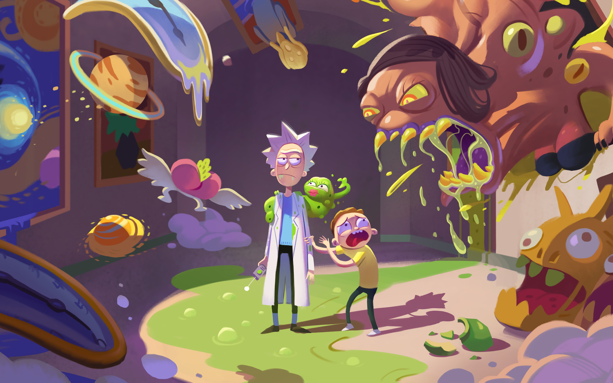

# *Rick y Morty API*

Sitio web hecho en ReactJS que consume la API de ***RICK AND MORTY***.

[RICK AND MORTY API](https://rickandmortyapi.com/)



## Tecnologias usadas

- HTML
- CSS
- Javascript
- JSX
- ReactJS
- CSS Modules
- Vite

## Instalación

Instalar las dependencias con 

```{Bash}
npm install
```
Ejecuta el programa

```{Bash}
npm run dev
```

Compila el codigo para producción

```{Bash}
npm run build
```

## Imagenes del programa

***Vista Desktop***


***Vista Mobile***


## Licencia

Copyright 2022 Renato Navarro Alberco